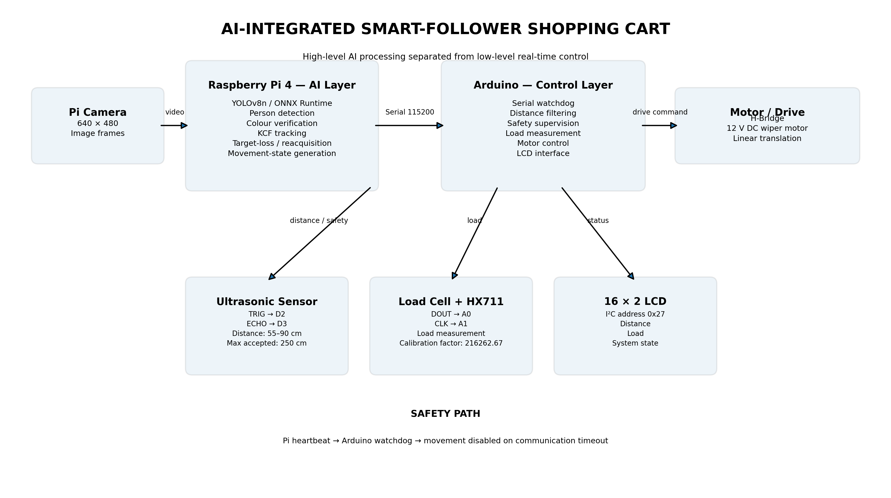

# AI-Integrated Smart-Follower Shopping Cart

> **Design and Development of an AI-Integrated Smart-Follower Shopping Cart**

A low-cost AI-enabled mechatronic prototype that combines **computer vision, object tracking, ultrasonic distance sensing, load measurement, embedded control, and motor actuation** to provide semi-autonomous linear following assistance.

The system uses a **Raspberry Pi 4** for high-level vision processing and an **Arduino** for real-time sensing, safety supervision, motor control, and user feedback.

---

## Project Overview

Conventional shopping carts require continuous manual pushing. This project investigates a low-cost alternative in which the cart can automatically translate toward or away from a designated user while monitoring distance, load, and safety conditions.

The prototype integrates:

- **YOLOv8n** for human detection
- **KCF** for lightweight continuous target tracking
- **Colour-based target verification**
- **Ultrasonic sensing** for distance and safety response
- **HX711 + load cell** for load measurement
- **Arduino-based** low-level control
- **Raspberry Pi–Arduino serial communication**
- **Watchdog-based communication safety**
- **LCD status and measurement display**
- **Bidirectional DC motor control**

The autonomous movement is intentionally limited to **linear translation**. Steering during turns remains under user control.

---

## System Architecture



The system is divided into two principal control layers.

### High-Level AI Layer — Raspberry Pi 4

The Raspberry Pi handles computationally intensive tasks:

1. Camera acquisition
2. YOLOv8n person detection
3. Target selection and verification
4. KCF target tracking
5. Target-loss and reacquisition logic
6. Movement-state generation
7. Serial communication with the Arduino

### Low-Level Embedded Layer — Arduino

The Arduino provides deterministic hardware control:

1. Ultrasonic distance measurement
2. Distance filtering
3. Load-cell measurement through HX711
4. Safety supervision
5. Raspberry Pi communication watchdog
6. Motor direction and burst control
7. LCD feedback

This separation keeps high-level AI processing independent from time-critical hardware and safety functions.

---

## AI and Computer Vision Pipeline

```text
Pi Camera
    │
    ▼
┌──────────────┐
│   YOLOv8n    │
│ Person       │
│ Detection    │
└──────┬───────┘
       │
       ▼
Target Selection
       │
       ▼
Colour Verification
       │
       ▼
┌──────────────┐
│     KCF      │
│   Tracking   │
└──────┬───────┘
       │
       ▼
Target Position / State
       │
       ▼
Movement Permission
       │
       ▼
Arduino
```

### YOLOv8n

The Raspberry Pi runs a YOLOv8n model exported to **ONNX** format using ONNX Runtime.

Current configuration includes:

| Parameter | Value |
|---|---:|
| Model | YOLOv8n |
| Model format | ONNX |
| Input size | 640 × 640 |
| Camera frame | 640 × 480 |
| Person class ID | 0 |
| Runtime | ONNX Runtime |
| Execution | CPU |

### KCF Tracking

KCF (Kernelized Correlation Filters) provides lightweight continuous tracking between detector updates.

The architecture therefore separates:

**Detection → Target verification → Tracking**

rather than running full object detection on every camera frame.

The implementation includes tracker-failure handling, bounding-box validation, YOLO-based correction, target-loss handling, and reacquisition logic.

---

## Target Identification

The system can verify the selected target using colour information extracted from the tracked bounding box.

The colour-verification subsystem uses:

- HSV colour representation
- Multiple samples
- Hue, saturation, and value tolerances
- Valid-colour ratio
- Confidence accumulation
- Strong and weak match thresholds

This provides an additional identity check when multiple people are present.

---

## Raspberry Pi–Arduino Communication

The Raspberry Pi communicates with the Arduino through USB serial communication.

| Parameter | Value |
|---|---|
| Serial interface | `/dev/ttyACM0` |
| Baud rate | `115200` |
| Heartbeat interval | `200 ms` |
| Arduino timeout | `3000 ms` |

The movement protocol is intentionally simple:

| Command | Meaning |
|---|---|
| `1` | Movement permitted |
| `0` | Stop movement |

The Pi periodically transmits the current movement state to the Arduino.

### Communication Watchdog

The Arduino independently monitors Raspberry Pi communication.

```text
Raspberry Pi
     │
     │ heartbeat
     ▼
 Arduino watchdog
     │
     ├── heartbeat valid ──► normal operation
     │
     └── timeout ──────────► movement disabled
```

If communication is lost beyond the configured timeout, the Arduino disables movement.

---

## Linear Following Control

The prototype uses a single drive motor for linear translation rather than differential-drive autonomous steering.

The basic distance-control relationship is:

```text
                  Target detected?
                    /          \
                  NO            YES
                  │              │
                STOP        Measure distance
                                 │
                    ┌────────────┼────────────┐
                    │            │            │
                    ▼            ▼            ▼
                 Too far     Follow zone   Too close
                    │            │            │
                    ▼            ▼            ▼
                 FORWARD        STOP        REVERSE
```

### Current Distance Parameters

| Parameter | Value |
|---|---:|
| Minimum following distance | 55 cm |
| Maximum following distance | 90 cm |
| Maximum accepted distance | 250 cm |
| Distance samples | 5 |
| Motor PWM | 140 |
| Motor ON time | 30 ms |
| Motor OFF time | 100 ms |
| Direction reversal delay | 300 ms |

The motor burst controller has an effective duty ratio of:

\[
D = \frac{30}{30+100}\times100 \approx 23.1\%
\]

---

## Distance Measurement

An ultrasonic sensor measures the separation between the cart and the target.

### Connections

```text
TRIG → Arduino pin 2
ECHO → Arduino pin 3
```

Distance is calculated from the echo time:

\[
d = \frac{t \times 0.0343}{2}
\]

where:

- \(d\) = distance in cm
- \(t\) = echo duration in µs
- \(0.0343\) = approximate speed of sound in cm/µs

Five samples are used for distance filtering.

Invalid measurements are handled separately so that a transient invalid echo does not unnecessarily overwrite the last valid filtered distance.

---

## Load Measurement

The cart uses a load cell connected through an **HX711 amplifier**.

### Connections

```text
HX711 DOUT → A0
HX711 CLK  → A1
```

Calibration factor currently used by the embedded controller:

```text
216262.67
```

A 1.500 kg reference load produced approximately 1.501 kg during calibration.

---

## Motor Control

The propulsion system uses a **12 V DC automotive windshield-wiper motor**.

The motor is controlled through a bidirectional H-bridge.

```text
Arduino
   │
   ▼
H-Bridge
   │
   ▼
12 V DC Wiper Motor
   │
   ▼
Linear Cart Motion
```

Direction reversal is protected by an intermediate stop:

```text
FORWARD
   │
   ▼
STOP
   │
   ▼
300 ms delay
   │
   ▼
REVERSE
```

This prevents an immediate electrical command reversal while the motor is operating.

---

## LCD User Interface

A 16 × 2 I²C LCD provides local feedback.

| Parameter | Value |
|---|---|
| Display | 16 × 2 LCD |
| Interface | I²C |
| Address | `0x27` |

The display provides information including:

- User distance
- Cart load
- Movement state
- Communication state
- Following/safety state

---

## Hardware / Software Stack

### Raspberry Pi

| Component | Technology |
|---|---|
| Computer | Raspberry Pi 4 |
| OS | Raspberry Pi OS Lite 64-bit |
| Language | Python |
| Camera | Picamera2 |
| Detection | YOLOv8n |
| Model runtime | ONNX Runtime |
| Tracking | OpenCV KCF |
| Numerical processing | NumPy |
| Serial communication | PySerial |

### Arduino

| Component | Technology |
|---|---|
| Language | C/C++ |
| Distance sensor | Ultrasonic |
| Load measurement | HX711 + load cell |
| Display | 16 × 2 I²C LCD |
| Motor driver | H-bridge |
| Propulsion | 12 V DC wiper motor |
| Communication | Serial |

---

## Repository Structure

```text
AI-Integrated-Smart-Follower-Shopping-Cart/
│
├── README.md
│
├── raspberry_pi/
│   ├── tracker.py
│   ├── requirements.txt
│   └── models/
│       └── yolov8n.onnx
│
├── arduino/
│   └── smart_follower_cart.ino
│
├── docs/
│   ├── system_architecture.png
│   ├── control_flow.png
│   └── wiring_diagram.png
│
├── media/
│   ├── prototype.jpg
│   ├── detection_demo.jpg
│   └── tracking_demo.mp4
│
└── LICENSE
```

---

## Installation

### 1. Clone the repository

```bash
git clone https://github.com/YOUR_USERNAME/YOUR_REPOSITORY.git
cd YOUR_REPOSITORY
```

### 2. Create the Python environment

```bash
python3 -m venv tracker-env
source tracker-env/bin/activate
```

### 3. Install dependencies

```bash
pip install -r raspberry_pi/requirements.txt
```

### 4. Place the YOLO model

The ONNX model should be located at:

```text
raspberry_pi/models/yolov8n.onnx
```

### 5. Upload the Arduino firmware

Open the Arduino sketch in the Arduino IDE and upload it to the microcontroller.

Verify the hardware connections and pin assignments before powering the motor system.

---

## Running the Vision System

From the Raspberry Pi project directory:

```bash
python tracker.py
```

The application initializes the camera, loads the YOLO model, performs person detection, maintains KCF tracking, determines movement permission, and communicates the resulting state to the Arduino.

---

## Experimental Results

Selected prototype measurements are shown below.

| Test / Parameter | Result |
|---|---:|
| Ultrasonic tested range | 30–250 cm |
| Ultrasonic MAPE | 4.51% |
| Reference load | 1.500 kg |
| Measured reference load | 1.501 kg |
| Initial normal-following success | 3/5 trials |
| Safety-response MAE | 3.75 cm |
| Extended test duration | 10 min 27 s |
| Initial extended-test voltage | 26.3 V |
| Final extended-test voltage | 23.9 V |
| Maximum observed motor temperature | 37.1 °C |

These values represent experimental prototype results rather than production-level performance specifications.

---

## Current Limitations

The current prototype has the following limitations:

- Autonomous movement is limited to linear translation.
- Steering during turns remains manual.
- Visual tracking can be affected by significant camera motion and occlusion.
- Target reacquisition is not instantaneous under all conditions.
- Ultrasonic measurements can vary with target geometry and environmental conditions.
- The prototype does not perform autonomous mapping or global path planning.
- Automatic billing and inventory-management functions are outside the project scope.
- Further long-duration reliability testing is required.

---

## Future Development

Potential extensions include:

- Autonomous steering
- Improved target re-identification
- Multi-sensor fusion
- Improved obstacle detection
- More advanced motor control
- Improved target reacquisition
- Camera stabilisation
- Longer-duration reliability testing
- Operation in more crowded environments
- Integration with ROS 2
- Autonomous navigation and path planning

---

## Project Status

**Status: Functional research prototype**

This repository contains the software and embedded-control implementation developed for a final-year Mechanical Engineering project investigating low-cost AI-assisted human-following technology.

---

## Author

**Mercy Testimony Okanlawon**

Department of Mechanical Engineering  
Ladoke Akintola University of Technology (LAUTECH)  
Ogbomoso, Oyo State, Nigeria

---

## Acknowledgements

This project brings together:

**Mechanical Engineering · Embedded Systems · Computer Vision · Artificial Intelligence · Control Engineering**

to demonstrate the practical integration of AI and mechatronics in an intelligent mobility-assistance platform.

---

## License

Add an appropriate open-source license before distributing the repository publicly.
